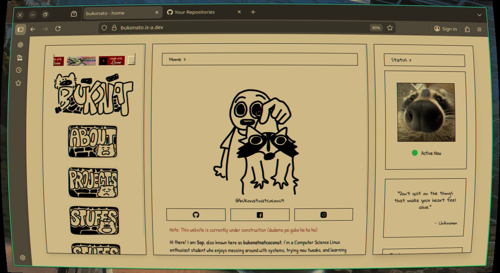

# ctv-based-shader
a shader that looks like an old ctv for hyprland.

## Sample 


## Installation
First, clone it:
```
git clone https://github.com/bukonatnat/ctv-based-shader.git
```

If you don't have git, install it first:
```
sudo pacman -S git
```

Now, make a directory (anywhere):
```
mkdir /.config/hypr/shaders/
```

Copy and paste the file to your folder:
```
cp /ctv-based-shader/crt.glsl .config/hypr/shaders/
```
Enable it in your hyprland config file:
```
# Put this on decoration {...}

decoration{
  screen_shader = ~/.config/hypr/shaders/crt.glsl
  ...
}
```

Reload hyprland config to apply it:
```
hyprctl reload
```

I'll assume it's working and running fine now.

## More
If it doesn't install properly, please DM me on [Discord](https://discord.com/users/imbukonato) **@imbukonato**

